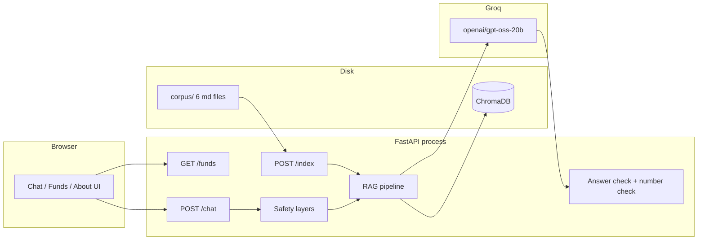
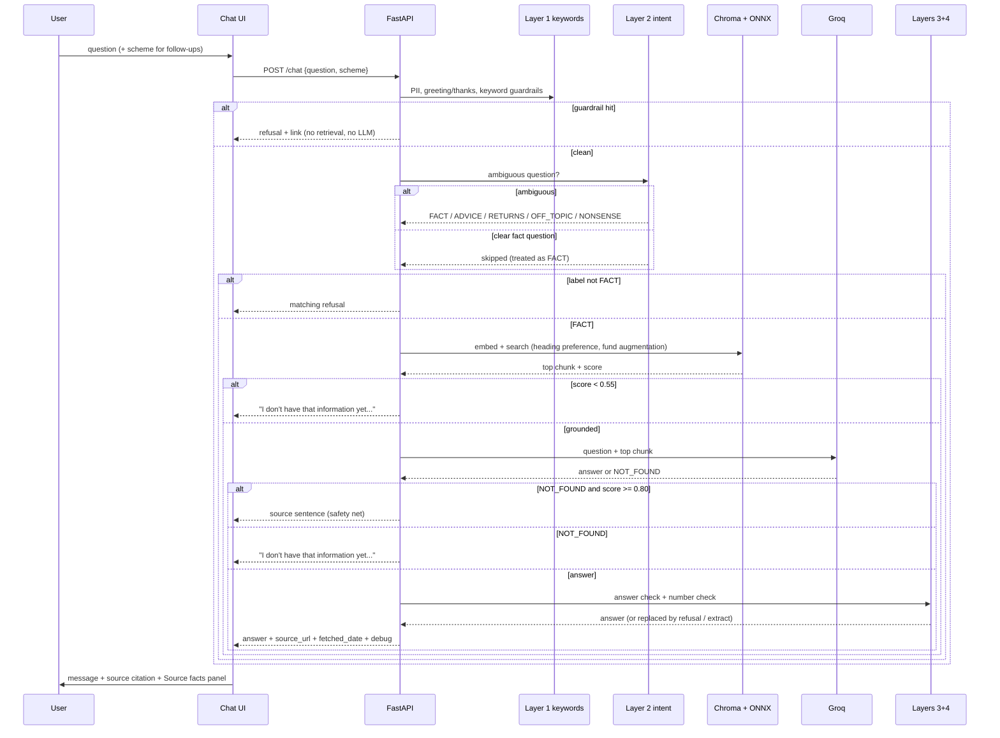

# Architecture

**Product:** Tathya — Mutual Fund FAQ Assistant, a facts-only RAG chatbot
**Scope:** 5 HDFC Mutual Fund schemes (Large Cap, Flexi Cap, ELSS, Small Cap, Balanced Advantage) plus `mf-basics`, per `problem_statement.md`
**Principle:** Local-first RAG. One laptop, curated corpus from 5 public Groww URLs, FastAPI, ChromaDB, ONNX embeddings. Retrieval, generation and citation in one pipeline, with four safety layers around it. Only the Groq key, stored in `.env`, is a secret — never committed.

---

## 1. Design goals

| Goal | How architecture supports it |
|------|------------------------------|
| Factual accuracy | Groq answers only from the single retrieved chunk; Layer 3 answer check and Layer 4 number check verify the text afterwards |
| Source traceability | Code (not the LLM) attaches exactly one `source_url` + `fetched_date` to every answer |
| Safety first | Four layers: keyword guardrails → AI intent check → answer check → number check |
| Demo on a laptop | Local vector store (ChromaDB); local ONNX embeddings on CPU |
| No accounts | Stateless chat session in browser; no auth, no user data |

---

## 2. High-level system



**Not in the system:** Groww production APIs, user portfolios, KYC, runtime crawlers, fine-tuning, streaming.

---

## 3. Stack (fixed)

| Layer | Choice | Why |
|-------|--------|-----|
| UI | Vanilla HTML/CSS/JS (`web/index.html`, `web/styles.css`, `web/app.js`) served by FastAPI | Tiny, portable; responsive layouts for mobile, tablet and desktop |
| API | Python FastAPI (`src/api.py`) | Simple, fast, serves the UI and the JSON API from one process |
| Chunking | Split by markdown heading; each FAQ pair its own chunk | One fact per chunk, exact citations (see README "Chunking Strategy") |
| Embeddings | `all-MiniLM-L6-v2` in ONNX via ChromaDB's `ONNXMiniLM_L6_V2` | CPU-only, no PyTorch, no API key |
| Vector store | ChromaDB persisted under `data/chroma/` | Local, no extra server |
| LLM | **Groq**, `openai/gpt-oss-20b` (temperature 0) for both answer generation and intent classification | One key, two short calls; problem statement §7: "Use an LLM to write a short answer grounded only in the retrieved chunks" |
| Secrets | **Only the Groq key**, stored in `.env`, never committed | `.env.example` documents `GROQ_API_KEY`, `GROQ_MODEL` |

---

## 4. Repository layout

```
Groww Rag Bot/
  problem_statement.md       # project brief (source of truth)
  architecture.md            # this file
  implementation.md          # pipeline implemented module by module
  README.md                  # user-facing docs
  SAMPLE_QA.md               # 10 verified Q&A examples
  corpus/                    # 6 markdown files (5 funds + mf-basics)
  data/chroma/               # persisted vectors (gitignored)
  src/
    ingest.py                # load -> heading split -> embed -> upsert
    retrieve.py              # scheme detect, heading preference, top-k + scores
    guardrails.py            # Layer 1 keyword guardrails
    intent.py                # Layer 2 AI intent check (Groq)
    generate.py              # Groq answer + extractive fallback
    api.py                   # FastAPI routes, Layer 3 + Layer 4 checks, safety net
    common.py                # shared singletons + thresholds
  web/
    index.html, styles.css, app.js, brand/
  tests/
    eval_questions.csv       # 128 eval questions (31 adversarial)
    last_failed.txt          # failed row numbers from the last eval run
  scripts/
    run_eval.py              # evaluation runner
  .gitignore
  requirements.txt
```

---

## 5. Runtime components

### 5.1 UI

- Three views in one app: **Chat**, **Funds**, **About** — top nav (tablet/desktop) and bottom nav (mobile).
- Chat: single-session in memory, no login. Answer display: short answer, exactly one source link, "Last updated from sources: [date]".
- **Source facts panel:** after an answer, shows the cited fund's key facts, an "Open source page" button and the investment disclaimer.
- **Funds view:** key facts for all 5 funds from `GET /funds`, each with **Ask about this fund** (selects the fund and opens the composer) and a source link.
- **About view:** what Tathya does/does not do, funds covered, sources with the data date, disclaimer, credits.
- The selected fund travels with each request as `scheme`, so follow-up questions stay on the same fund.
- Empty / error states: API down, index missing, timeout.

### 5.2 API

| Method | Path | Role |
|--------|------|------|
| `POST` | `/chat` | Safety layers → retrieve → generate → checks → answer + source + date |
| `GET` | `/funds` | Key facts for the 5 funds, parsed from `corpus/` |
| `GET` | `/health` | Process up; index exists |
| `POST` | `/index` | Rebuild vector store from `corpus/` |
| `GET` | `/` | The UI (`web/index.html`), plus `/styles.css`, `/app.js`, `/brand/*` |

No user store. No session state on server.

### 5.3 RAG pipeline (strict order)

1. **PII check** — PAN, Aadhaar, account numbers, OTP, email, phone, password → refused immediately, nothing stored or retrieved.
2. **Identity / greeting / thanks** — short friendly replies ("who are you", "hi", "thanks"), checked before retrieval and before any AI call.
3. **Keyword guardrails** (Layer 1, no AI):
   - **Advice:** "should I buy / sell / invest", "can I invest", "which is better", "recommend", "best fund", … → refusal + AMFI link. Factual how-tos ("How can I invest via SIP…") are exempt.
   - **Returns / performance:** "returns", "past performance", "CAGR", "NAV history", "profit", … → refusal + HDFC factsheet link.
   - **Live data:** "NAV", "today", "current price", "live", "right now" → refusal + the fund's own page link.
   - **Plan type:** "regular plan", "IDCW", "dividend" → clarifies only Direct Plan (Growth option) is covered.
   - **Other funds / AMCs:** any other AMC, or HDFC schemes outside the 5 → refusal.
   - **Clarify:** a scheme-level fact with no fund named → asks the user to pick one of the 5.
4. **AI intent check** (Layer 2) — only for ambiguous questions. If the question already contains a fund-fact keyword ("expense ratio", "exit load", "SIP", …), the check is skipped (`debug.intent = "skipped"`). Otherwise one short Groq call labels it FACT / ADVICE / RETURNS / OFF_TOPIC / NONSENSE; ADVICE and RETURNS get the matching refusals, OFF_TOPIC and NONSENSE get their replies, FACT continues. On any error it falls back to FACT (keyword result) — never crashes.
5. **Retrieval** — embed the question with the same ONNX model and search ChromaDB:
   - **Heading preference:** if the question maps to a fact heading ("expense ratio" → `Expense Ratio`) and a fund is known, first search that fund's chunks for that heading; if nothing scores ≥ 0.55, fall back to a fund-only search.
   - **Fund-name augmentation for follow-ups:** when a fund is active (UI `scheme` or detected from the text) *and* the question contains a fund-fact keyword, the fund's short name is appended to the query ("What is the AUM?" → "What is the AUM? HDFC Small Cap Fund"). Otherwise the question is retrieved as-is.
   - **All-funds queries** ("all", "each", "lowest", "highest", "compare") pull the same fact heading from each of the 5 funds and build a compact list.
   - **Definitional queries** ("What is SIP?") with no fund search `mf-basics`.
6. **Score gate** — the best similarity must be ≥ `0.55` (`SCORE_THRESHOLD`). Below it: "I don't have that information yet. Try asking about the expense ratio, exit load, minimum SIP, lock-in period, riskometer, benchmark or fund managers." (No LLM call.)
7. **Groq** — writes a short answer from the top chunk only (temperature 0). Prompt rules: answer only from the provided chunk, max 2 sentences, no advice, no returns/performance numbers, never output URLs, keep every condition from the source exactly (e.g. "for units above 15% of the investment"), reply exactly `NOT_FOUND` if the chunk does not contain the answer.
8. **Answer check** (Layer 3) — if the generated text contains advice language ("you should", "i recommend", "worth investing", "good choice", …), it is replaced with the advice refusal (`debug.answer_check = "blocked"`).
9. **Number check** (Layer 4) — every number in the answer (percentages, ₹ amounts, years, dates) must appear in the retrieved chunk text (ignoring commas/spaces). If one does not, the answer is replaced by the extractive sentence from that chunk (`debug.number_check = "fallback"`).
10. **Safety net** — if Groq replies `NOT_FOUND` but the top match scores ≥ `0.80` (`NOT_FOUND_OVERRIDE_THRESHOLD`), the fact sentence from that chunk is returned instead (`debug.not_found_override = true`); otherwise the standard "I don't have that information yet…" reply is used.

**After generation (any path):** code attaches `source_url` and `fetched_date` from the top chunk's metadata, and normalizes exit-load wording ("redeemed" → "sold", "will be charged" removed).

**Fallback:** if the Groq call fails (error, timeout, missing `GROQ_API_KEY`), the best 1–3 sentences from the top chunk are returned with `debug.fallback = true`.

**Response shape:** `{ answer, title, source_url, fetched_date, debug }`

### 5.4 Indexer (offline / on-demand)

Triggered by `POST /index` or `python -m src.ingest` (also at Docker build time):

```
corpus/*.md -> front matter -> split by ## headings (FAQ section split per Q&A)
            -> embed with ONNX MiniLM -> full rebuild of ChromaDB
```

Each vector's metadata: `chunk_id`, `scheme_name`, `category`, `source_url`, `fetched_date`, `heading`. The text itself carries the heading prefix ("Expense Ratio: …") so a chunk makes sense alone. Current corpus: **113 chunks across 6 files**. Re-index is always a full rebuild (demo scale).

---

## 6. Request flow (happy path)



---

## 7. Generation contract (Groq)

**Input:** the top chunk's text + the user question
**Output:** a short answer grounded only in that chunk
**Parameters:** `temperature=0`, `max_tokens=800`, model `GROQ_MODEL` (`openai/gpt-oss-20b`), `reasoning_effort=low`
**Prompt rules (src/generate.py):**
- Answer only from the provided chunk; no external knowledge
- Max 2 sentences (problem statement requires ≤ 3)
- No investment advice; no returns or performance numbers; never output URLs
- Write the fund name with the plan in brackets, e.g. "HDFC Large Cap Fund (Direct Growth)"
- Keep every condition from the source exactly (e.g. "for units above 15% of the investment")
- Answer only the fact asked; use the first (most relevant) chunk that contains the answer
- Reply exactly `NOT_FOUND` if the chunk does not contain the answer

**Response handling:**
- `NOT_FOUND` + score ≥ 0.80 → safety net returns the source sentence
- `NOT_FOUND` below 0.80 → "I don't have that information yet…" reply
- Call fails (error / timeout / no key) → extractive fallback from the top chunk, `debug.fallback: true`
- Answer returned → Layer 3 answer check, Layer 4 number check, then metadata attached

---

## 8. Retrieval policy

| Parameter | Value | Notes |
|-----------|-------|-------|
| `k` | 1 | `POST /chat` retrieves the single best chunk (the all-funds path takes 1 per fund) |
| Similarity threshold | `0.55` (cosine) | `SCORE_THRESHOLD`; below it no LLM call happens |
| Safety-net threshold | `0.80` | `NOT_FOUND_OVERRIDE_THRESHOLD`; overrides a `NOT_FOUND` reply |
| Heading preference | scheme + heading first, scheme-only fallback | Precision for fact questions |
| Follow-up augmentation | fund short name appended only when the question has a fund-fact keyword | Keeps plain questions untouched |
| Chunking | markdown heading split, FAQ Q&A pairs separate | One fact per chunk, ~50–300 chars, no overlap |
| Query | Raw question (+ fund name when applicable) | No general query rewrite |

Out-of-corpus examples (live price, "should I buy", other AMCs) must hit a guardrail or the score gate — never return a fabricated number.

---

## 9. Safety layers (code + prompt, defense in depth)

| Layer | Check | Implementation |
|-------|-------|----------------|
| 1 | PII | Regex for PAN, Aadhaar, account numbers, OTP, email, phone, passwords |
| 1 | Advice | Phrase list + whole-word keyword list ("should I buy", "can i invest", "which is better", …) with a factual how-to exception; returns refusal + AMFI link |
| 1 | Returns / performance | Phrase list ("returns", "CAGR", "past performance", …) with benchmark exceptions; refusal + HDFC factsheet link |
| 1 | Live data | "NAV", "today", "live", "right now" → fund page link |
| 1 | Plan type | "regular plan", "IDCW", "dividend" → Direct Plan (Growth) clarification |
| 1 | Other funds | Other AMCs and HDFC schemes outside the 5 → refusal |
| 2 | AI intent check | One short Groq call for ambiguous questions only; labels FACT / ADVICE / RETURNS / OFF_TOPIC / NONSENSE; keyword fast paths and graceful fallback to FACT |
| 3 | Answer check | Advice-phrase scan of the generated answer → replaced by the advice refusal |
| 4 | Number check | Every number in the answer must exist in the retrieved chunk → otherwise extractive replacement |
| — | Score gate | 0.55 before any generation; safety net 0.80 after `NOT_FOUND` |

Educational links (constants in `guardrails.py`):
- AMFI (PII + advisory refusals): `https://www.mutualfundssahihai.com/en`
- HDFC factsheet (returns/performance refusals): `https://www.hdfcfund.com/mutual-funds/factsheets`

Disclaimer in the UI (static): "Facts-only. No investment advice."

---

## 10. Observability (demo)

`POST /chat` response shape:

```json
{
  "answer": "HDFC Large Cap Fund (Direct Growth) has an expense ratio of 1.03%.",
  "title": null,
  "source_url": "https://groww.in/mutual-funds/hdfc-large-cap-fund-direct-growth",
  "fetched_date": "27 Sep 2026",
  "debug": {
    "threshold_passed": true,
    "matches": [{ "chunk_id": "hdfc-large-cap-fund-direct-growth-004", "score": 0.9115 }],
    "guardrail": null,
    "fallback": false,
    "intent": "skipped",
    "answer_check": "ok",
    "number_check": "ok"
  }
}
```

Guardrail response:

```json
{
  "answer": "I share facts only. To learn more about investing, visit AMFI's Mutual Funds Sahi Hai.",
  "title": "I can't give investment advice.",
  "source_url": "https://www.mutualfundssahihai.com/en",
  "fetched_date": "27 Sep 2026",
  "debug": { "threshold_passed": false, "matches": [], "guardrail": "advisory", "fallback": false }
}
```

`debug.guardrail` is one of: `pii`, `greeting`, `thanks`, `advisory`, `returns`, `live_data`, `plan_type`, `out_of_scope`, `clarify`, `not_found`.

---

## 11. Configuration

| Variable | Purpose | Default |
|----------|---------|---------|
| `CHROMA_PATH` | Vector store path | `data/chroma` |
| `CORPUS_PATH` | Corpus folder | `corpus` |
| `COLLECTION_NAME` | ChromaDB collection | `mf_faq` |
| `TOP_K` | Retrieval k (the API passes 1 explicitly) | `1` |
| `SCORE_THRESHOLD` | Score gate | `0.55` |
| `NOT_FOUND_OVERRIDE_THRESHOLD` | Safety net for `NOT_FOUND` | `0.80` |
| `GROQ_API_KEY` | Groq API key | (required for LLM calls; extractive fallback without it) |
| `GROQ_MODEL` | Groq model name | `openai/gpt-oss-20b` |

`.env` (gitignored) holds `GROQ_API_KEY` and overrides; `.env.example` documents them. Embeddings and ChromaDB stay local.

---

## 12. Failure modes

| Failure | User-visible behavior |
|---------|------------------------|
| Empty / missing index | Built automatically at startup if missing; otherwise 503 "Knowledge base not built…" |
| Embedding model load error | Generic error; no fake facts |
| Timeout / API down | UI error state; last user message kept |
| Low similarity (< 0.55) | "I don't have that information yet. Try asking about…" + debug matches |
| Guardrail hit | Short refusal + educational link; no retrieval, no LLM |
| Groq API error / missing key | Extractive answer from the top chunk; `debug.fallback: true` |
| Groq rate limit (429) | Eval retries after 30s; live app falls back to extractive answers |
| Answer contains advice language | Replaced by the advice refusal (`answer_check: blocked`) |
| Answer contains a number not in the source | Replaced by the source sentence (`number_check: fallback`) |

---

## 13. Mapping to problem_statement.md

| Requirement | Architecture |
|-------------|--------------|
| 5 HDFC schemes, public URLs | `corpus/` curated from 5 URLs; metadata carries `source_url` |
| Facts-only, no advice | Layer 1 advice guardrails, Layer 2 intent check, Layer 3 answer check |
| One source link per answer | `source_url` from chunk metadata attached by code |
| "Last updated from sources: [date]" | `fetched_date` from chunk metadata |
| PII refusal | First check in the pipeline, regex patterns |
| Advisory refusal + AMFI link | Guardrail returns the AMFI educational URL |
| Returns/performance → factsheet link | Guardrail returns the HDFC factsheet URL |
| Answers ≤ 3 sentences | Prompt limits answers to 2 sentences |
| UI: welcome, examples, disclaimer | `web/index.html` (Chat/Funds/About, responsive) |
| Corpus rule: one AMC, 3–5 schemes | Enforced by corpus content (5 HDFC schemes) |
| Evaluation | `tests/eval_questions.csv` (128 questions, 31 adversarial) + `scripts/run_eval.py` |

---

## 14. What we will not add

- Any **other** LLM API (OpenAI, Anthropic, Ollama, etc.)
- Auth, user databases, rate limiting
- Scraping groww.in or the HDFC site at runtime (corpus is a one-time snapshot)
- Streaming responses
- Hybrid BM25 + vectors
- Live NAV / returns / performance data
