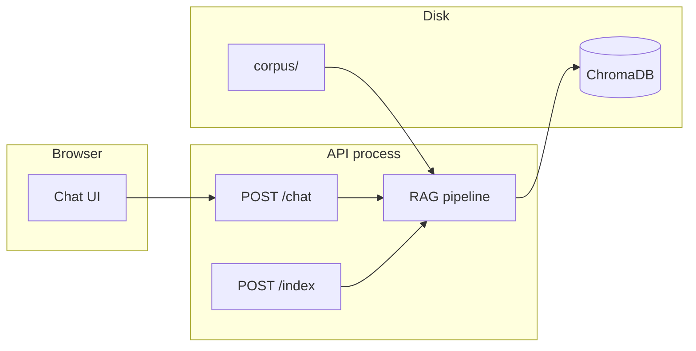
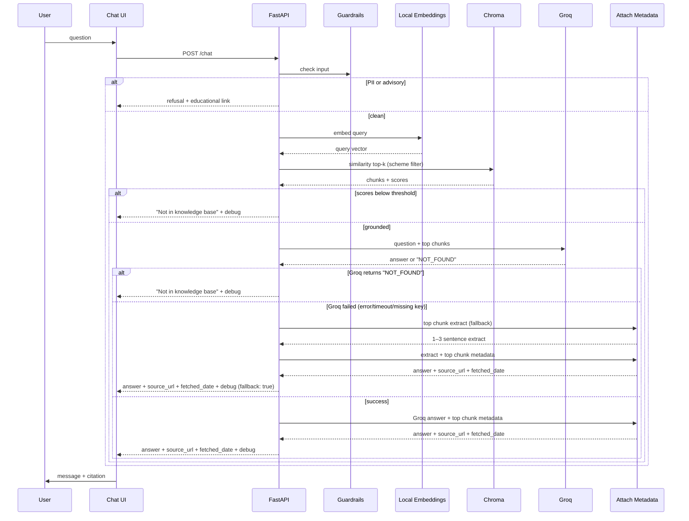

# Architecture

**Product:** Mutual Fund FAQ Assistant — RAG Chatbot  
**Scope:** 5 HDFC Mutual Fund schemes (Large Cap, Flexi Cap, ELSS, Small Cap, Balanced Advantage) per `problem_statement.md`  
**Principle:** Local-first RAG. One laptop, curated corpus from 5 public URLs, FastAPI, ChromaDB, local embeddings. Every answer is retrieve → generate → cite. Only Groq key, stored in `.env`, never committed.

---

## 1. Design goals

| Goal | How architecture supports it |
|------|------------------------------|
| Factual accuracy | Extractive answers only: best 1–3 sentences from retrieved chunks |
| Source traceability | Every answer cites exactly one source URL + fetched date |
| Guardrails first | PII and advisory intent screened before retrieval |
| Demo on a laptop | Local vector store (Chroma); local embeddings (sentence-transformers) |
| No accounts | Stateless chat session in browser; no auth, no secrets |

---

## 2. High-level system



**Not in the system:** Groww production APIs, user portfolios, KYC, crawlers, fine-tuning, streaming.

---

## 3. Stack (fixed)

| Layer | Choice | Why |
|-------|--------|-----|
| UI | Static HTML/JS (single file) | Tiny, portable, easy to show disclaimer + sources |
| API | Python FastAPI | Simple, fast, CORS for local demo |
| Chunking | Recursive character splitter (strategy chosen after inspecting Phase 6 corpus; reason documented in README) | Deterministic, explainable, adapted to actual document structure |
| Embeddings | `sentence-transformers/all-MiniLM-L6-v2` (local) | No API key; fast CPU inference |
| Vector store | ChromaDB persisted under `data/chroma/` | Local, no extra server |
| LLM | **Groq** (GPT-OSS / LLaMA-3 via `GROQ_API_KEY`, `GROQ_MODEL` from `.env`) | Problem statement §7: "Use an LLM to write a short answer grounded only in the retrieved chunks" |
| Secrets | **Only Groq key**, stored in `.env`, never committed | `.env.example` documents `GROQ_API_KEY`, `GROQ_MODEL` |

---

## 4. Repository layout

```
Groww Rag Bot/
  problem_statement.md
  architecture.md
  implementation.md
  corpus/                    # 5 markdown files, one per scheme
  data/chroma/               # persisted vectors (gitignored)
  src/
    ingest.py                # load → chunk → embed → upsert
    retrieve.py              # embed query → top-k + scores
    generate.py              # extract best 1–3 sentences from chunks
    guardrails.py            # PII / advice / returns policy
    api.py                   # FastAPI routes
  web/
    index.html               # chat UI (single file)
  .gitignore
  requirements.txt
```

---

## 5. Runtime components

### 5.1 Chat UI

- Single-session chat in memory (browser). No login.
- Renders: welcome line, 3 example questions, disclaimer "Facts-only. No investment advice."
- Answer display: max 3 sentences, exactly one source link, "Last updated from sources: [date]"
- Empty / error states: index missing, API down, timeout.

### 5.2 API

| Method | Path | Role |
|--------|------|------|
| `POST` | `/chat` | Guard → retrieve → extract → return answer + source + date |
| `POST` | `/index` | Rebuild vector store from `corpus/` |
| `GET` | `/health` | Process up; index exists |

No user store. No session state on server.

### 5.3 RAG pipeline (strict order)

1. **Guard input** — reject PII (PAN, Aadhaar, account numbers, OTP, email, phone, passwords); refuse advisory intent with AMFI educational link; refuse returns/performance with HDFC factsheet link.
2. **Retrieve** — embed query with all-MiniLM-L6-v2; similarity search top-k (default 4) from Chroma with optional scheme filter.
3. **Gate** — if best score < threshold or k=0 → return "Not in knowledge base" + debug info.
4. **Generate** — pass top chunks + question to Groq (temperature 0). Prompt rules: answer only from provided chunks, max 3 sentences, no advice, no returns/performance numbers, never output URLs, reply exactly "NOT_FOUND" if chunks don't contain the answer.
5. **Handle Groq response** — if Groq returns "NOT_FOUND", return "Not in knowledge base" + debug (no fallback). If Groq call fails (error, timeout, missing `GROQ_API_KEY`), fall back to extractive answer (best 1–3 sentences from top chunk).
6. **Attach metadata** — code attaches `source_url` and `fetched_date` from the top chunk's metadata to the answer (Groq or fallback).

### 5.4 Indexer (offline / on-demand)

Triggered by `POST /index` or `python -m src.ingest`:

```
corpus files → load text → chunk + overlap → embed batch → upsert Chroma
```

Each vector metadata:
- `chunk_id`
- `scheme_name` (e.g., "HDFC Large Cap Fund – Direct Growth")
- `category` (e.g., "Large Cap")
- `source_url` (from problem_statement.md table)
- `fetched_date` (ISO date when corpus was collected)
- `text` (chunk body)

Re-index is **full rebuild** (demo-scale corpus).

---

## 6. Request flow (happy path)



Target: under ~3s end-to-end (local embeddings + extractive).

---

## 7. Generation contract (Groq)

**Input:** top-k chunk texts, user question  
**Output:** short answer grounded only in provided chunks  
**Groq parameters:** `temperature=0`, model from `GROQ_MODEL`  
**Prompt rules:**
- Answer only from the provided chunks
- Max 3 sentences
- No investment advice
- No returns or performance numbers
- Never output URLs
- Reply exactly "NOT_FOUND" if chunks don't contain the answer

**Response handling:**
- Groq returns "NOT_FOUND" → return "Not in knowledge base" (no fallback)
- Groq call fails (error, timeout, missing `GROQ_API_KEY`) → extractive fallback (best 1–3 sentences from top chunk by keyword overlap)
- Groq returns answer → attach `source_url` + `fetched_date` from top chunk metadata

No model generation if chunks are insufficient; gate returns "Not in knowledge base" before calling Groq.

---

## 8. Retrieval policy

| Parameter | Default | Notes |
|-----------|---------|--------|
| `k` | 4 | Enough for demo; readable in debug |
| Similarity threshold | 0.35 (cosine) | Tune on sample Q&A |
| Chunk size | Strategy chosen after inspecting corpus (see README) | Adapted to actual document structure |
| Overlap | ~10–15% | Headings and lists survive splits |
| Query | Raw question first | No rewrite in MVP |

Out-of-corpus examples (live price, portfolio value, "should I buy") must hit guardrails or the gate, not return fabricated numbers.

---

## 9. Guardrails (code + prompt defense in depth)

| Rule | Implementation |
|------|----------------|
| PII detection | Regex for PAN (10-char alphanumeric), Aadhaar (12-digit), account numbers, OTP (6-digit), email, phone, passwords |
| Advisory refusal | Phrases: "should I buy", "should I sell", "should I invest", "which is better", "recommend", "best fund" → return canned refusal + AMFI link. Do NOT block plain "buy" or "invest in" (e.g., "minimum amount to invest in HDFC ELSS" must work). |
| Returns/performance | Phrases: "returns", "past performance", "how much return", "CAGR", "NAV history" → return canned refusal + HDFC factsheet link. Do NOT block "growth" (appears in every scheme name). |
| Weak retrieval | Score gate before extract; return "Not in knowledge base" |
| Disclaimer in UI | Static: "Facts-only. No investment advice." |

Educational links (constants in `guardrails.py`):
- AMFI (advisory refusals): `https://www.mutualfundssahihai.com/en`
- HDFC factsheet (returns/performance refusals): `https://www.hdfcfund.com/mutual-funds/factsheets`

---

## 10. Observability (demo)

`POST /chat` response shape:

```json
{
  "answer": "Expense ratio is 0.45% per annum.",
  "source_url": "https://groww.in/mutual-funds/hdfc-large-cap-fund-direct-growth",
  "fetched_date": "2025-01-15",
  "debug": {
    "threshold_passed": true,
    "matches": [
      { "chunk_id": "hdfc-large-cap-003", "score": 0.78, "scheme_name": "HDFC Large Cap Fund – Direct Growth" }
    ]
  }
}
```

Refusal response:
```json
{
  "answer": "I cannot provide investment advice. For investor education, visit AMFI: https://www.mutualfundssahihai.com/en",
  "source_url": "https://www.mutualfundssahihai.com/en",
  "fetched_date": "2025-01-15",
  "debug": {
    "threshold_passed": false,
    "guardrail": "advisory",
    "matches": []
  }
}
```

---

## 11. Configuration

| Variable | Purpose | Default |
|----------|---------|---------|
| `CHROMA_PATH` | Vector store path | `data/chroma` |
| `CORPUS_PATH` | Corpus folder | `corpus` |
| `TOP_K` | Retrieval k | `4` |
| `SCORE_THRESHOLD` | Gate threshold | `0.35` |
| `EMBEDDING_MODEL` | Local model name | `sentence-transformers/all-MiniLM-L6-v2` |
| `GROQ_API_KEY` | Groq API key | (required for LLM generation) |
| `GROQ_MODEL` | Groq model name | `openai/gpt-oss-20b` |

`.env` required for `GROQ_API_KEY` and `GROQ_MODEL`. `.env.example` documents them. Embeddings stay local; ChromaDB stays the same.

---

## 12. Failure modes

| Failure | User-visible behavior |
|---------|------------------------|
| Empty / missing index | "Knowledge base not built; run ingest" |
| Embedding model load error | Generic error; no fake facts |
| Timeout | Ask to retry; keep last user message |
| Low similarity | "Not in the knowledge base" + debug matches |
| Guardrail hit | Short refusal + educational link; no retrieval |
| Groq API error / missing key | Falls back to extractive answer (best 1–3 sentences from top chunk); debug shows `fallback: true` |

---

## 13. Mapping to problem_statement.md

| Requirement | Architecture |
|-------------|--------------|
| 5 HDFC schemes, public URLs | `corpus/` curated from 5 URLs; metadata carries `source_url` |
| Facts-only, no advice | Guardrails block advisory; extractive answers only |
| One source link per answer | `source_url` from chunk metadata attached to every answer |
| "Last updated from sources: [date]" | `fetched_date` from chunk metadata |
| PII refusal | Input guardrail with regex patterns |
| Advisory refusal + AMFI link | Guardrail returns AMFI educational URL |
| Returns/performance → factsheet link | Guardrail returns HDFC factsheet URL |
| Answers ≤ 3 sentences | Extraction truncates to 3 sentences |
| UI: welcome, 3 examples, disclaimer | Static HTML in `web/index.html` |
| Corpus rule: one AMC, 3–5 schemes | Enforced by corpus content (5 HDFC schemes) |
| Source types: factsheets, KIM/SID, FAQs, fees, riskometer, statements | Corpus files cover these per scheme |

---

## 14. What we will not add

- Any **other** LLM API (OpenAI, Anthropic, Ollama, etc.)
- Auth, user databases, rate limiting
- Scraping groww.in or HDFC site at runtime
- Streaming responses
- Hybrid BM25 + vectors
- Evaluation harness
- Query rewrite (follow-ups) — out of scope for MVP

---

## 15. Build order (phases per implementation.md)

1. **Phase 6** — Corpus: create 5 markdown files from the 5 URLs
2. **Phase 7** — Chunking + ingest: `src/ingest.py` + `POST /index`
3. **Phase 8** — Answers + guardrails: `src/retrieve.py`, `src/generate.py`, `src/guardrails.py`, `POST /chat`
4. **Phase 9** — UI: `web/index.html` with welcome, 3 examples, disclaimer
5. **Phase 10** — Deliverables: README, source list, sample Q&A, demo verification