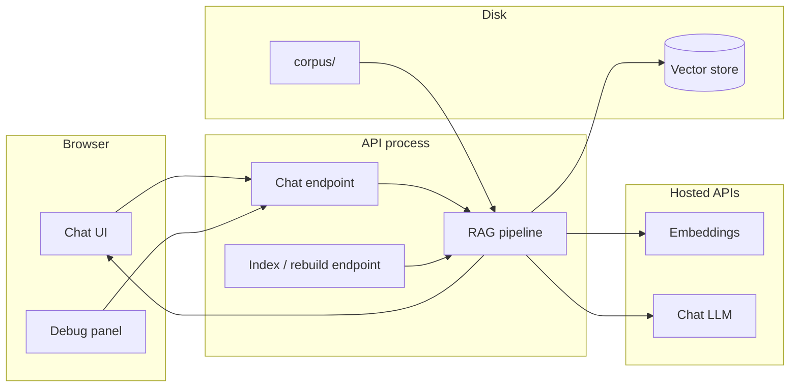
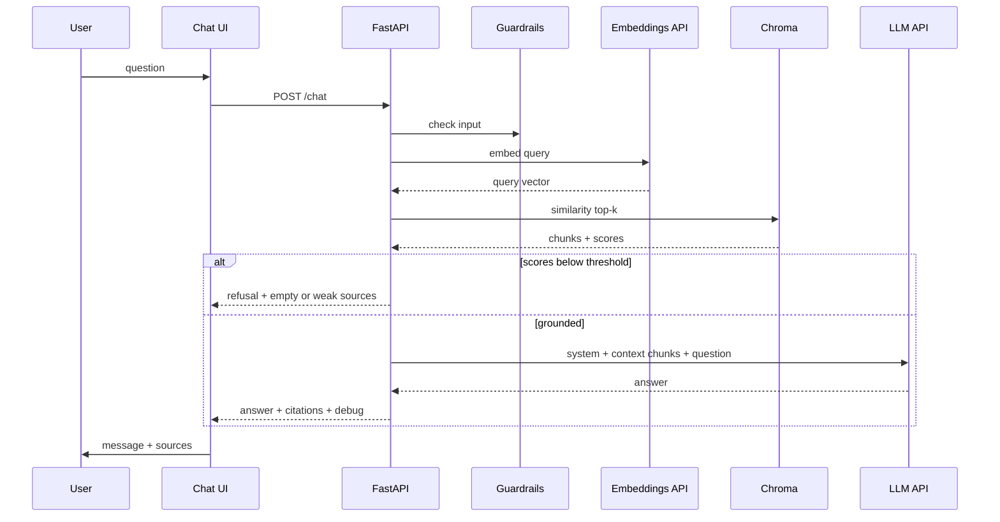

# Architecture

**Product:** Groww RAG Bot  
**Scope:** Class demo RAG chatbot (see `PRD.md`)  
**Principle:** One laptop, one corpus folder, one API, one chat UI. Every answer is retrieve → generate → cite.

---

## 1. Design goals

| Goal | How architecture supports it |
|------|------------------------------|
| Grounded answers | LLM sees retrieved chunks only, not Groww APIs or live market data |
| Teachable RAG | Debug payload returns top-k, scores, and chunk ids |
| Demo on a laptop | Local vector store; hosted embeddings + LLM via API key |
| Fail closed | Similarity threshold; refusal prompt when retrieval is weak |
| No accounts | Stateless chat session in the browser; no auth |

---

## 2. High-level system



**Not in the system:** Groww production APIs, user portfolios, KYC, crawlers, fine-tuning.

---

## 3. Recommended stack (demo default)

Chosen so a student can run ingest + chat in one afternoon. Swap pieces if needed; keep the pipeline the same.

| Layer | Choice | Why |
|-------|--------|-----|
| UI | Static HTML/JS or a small React/Vite app | FR-6; easy to show disclaimer + sources |
| API | Python FastAPI | Fast to wire RAG; simple CORS for local demo |
| Chunking | Recursive character splitter (~500–800 tokens, ~10–15% overlap) | FR-1; explainable in class |
| Embeddings | Hosted embedding model (OpenAI-compatible) | NFR-2, NFR-3 |
| Vector store | Chroma persisted under `data/chroma/` | Local, no extra server |
| LLM | Hosted chat model (OpenAI-compatible) | NFR-3 |
| Secrets | `.env` (`OPENAI_API_KEY` or equivalent) | NFR-4 |
| Corpus | `corpus/` markdown (and optional PDF) | NFR-5 |

**Local-only variant:** Ollama (or similar) for embeddings + LLM if the demo machine has enough RAM. Vector store stays on disk either way.

---

## 4. Repository layout

```
Groww Rag Bot/
  PRD.md
  architecture.md
  corpus/                 # curated knowledge base (source of truth)
  data/chroma/            # persisted vectors (gitignored)
  src/
    ingest.py             # load → chunk → embed → upsert
    retrieve.py           # embed query → top-k + scores
    generate.py           # build prompt → LLM → answer
    guardrails.py         # advice / secrets / empty-retrieval policy
    api.py                # FastAPI routes
  web/                    # chat UI + debug panel
  .env.example
```

---

## 5. Runtime components

### 5.1 Chat UI

- Single-session chat in memory (browser). No login (FR-6, FR-9 as in-memory history).
- Renders: assistant text, citations (source title, path, chunk id, short excerpt), disclaimer.
- Optional debug drawer: top-k list, scores, whether the threshold passed (FR-8).
- Empty / error states: index missing, API down, timeout.

### 5.2 API

| Method | Path | Role |
|--------|------|------|
| `POST` | `/chat` | Embed query, retrieve, generate, return answer + sources + debug |
| `POST` | `/index` | Rebuild vector store from `corpus/` (FR-7) |
| `GET` | `/health` | Process up; optionally “index exists” |

No user store. Optional `session_id` only if we pass recent turns for follow-ups (FR-9 / FR-10).

### 5.3 RAG pipeline

Four stages, always in this order:

1. **Guard input** — reject password/OTP/account-number style requests; block “what should I buy” as advice.
2. **Retrieve** — embed the question (or rewritten query); similarity search top-k.
3. **Gate** — if best score &lt; threshold or k=0 → skip LLM generation of Groww facts; return canned “not in knowledge base”.
4. **Generate** — system prompt + chunks + user question (+ short history); parse citations from used chunks.

### 5.4 Indexer (offline / on-demand)

Triggered by `POST /index` or `python -m src.ingest`:

```
corpus files → load text → chunk + overlap → embed batch → upsert Chroma
```

Each vector metadata:

- `chunk_id`
- `source_name` (file title)
- `source_path`
- `url` (optional)
- `text` (chunk body)

Re-index is **rebuild**, not fancy incremental sync (demo-scale corpus).

---

## 6. Request flow (happy path)



Target: under ~15s end-to-end with a hosted LLM (NFR-3).

---

## 7. Prompt contract

**System (fixed)**

- Answer only from the provided context.
- If context is missing or irrelevant, say the knowledge base does not cover it.
- No personalized financial advice; no account actions.
- Educational demo, not official Groww support.
- Cite sources by `source_name` / `chunk_id` that actually appear in context.

**User message**

- Current question.
- Optional last 2–4 turns (FR-9). If follow-up is ambiguous, rewrite to a standalone search query before retrieve (FR-10, later).

**Context block**

- Numbered chunks: id, source, text.

The UI citations must come from **retrieved metadata**, not from the model inventing URLs.

---

## 8. Retrieval policy

| Parameter | Demo default | Notes |
|-----------|--------------|--------|
| `k` | 4 | Enough for class; still readable in debug |
| Distance / similarity threshold | Tune on sample Q&A | FR-5 |
| Chunk size | ~500–800 tokens | Too large → noisy; too small → lost context |
| Overlap | ~10–15% | Headings and lists survive splits |
| Query | Raw question first | Add rewrite only if follow-ups fail |

Out-of-corpus examples from the PRD (live price, portfolio value) must hit the gate, not a hallucinated number.

---

## 9. Guardrails

Implemented in code **and** prompt (defense in depth).

| Rule | Where |
|------|--------|
| No buy/sell recommendations | `guardrails.py` + system prompt |
| No passwords / OTP / account numbers | input filter |
| No live balances or orders | architecture: no Groww APIs |
| Weak retrieval → refusal | score gate before generate |
| Disclaimer in UI | static copy, not model-dependent |

---

## 10. Observability (class)

`POST /chat` response shape (illustrative):

```json
{
  "answer": "...",
  "citations": [
    {
      "chunk_id": "overview-002",
      "source_name": "Groww overview",
      "source_path": "corpus/overview.md",
      "excerpt": "..."
    }
  ],
  "debug": {
    "rewritten_query": null,
    "threshold_passed": true,
    "matches": [
      { "chunk_id": "overview-002", "score": 0.82 }
    ]
  }
}
```

Do not return the full embedding vector in the UI by default (large, unreadable). Mention in the talk that the query was embedded; show scores instead.

---

## 11. Configuration and secrets

| Variable | Purpose |
|----------|---------|
| `OPENAI_API_KEY` (or provider equivalent) | Embeddings + LLM |
| `EMBEDDING_MODEL` | Embedding model id |
| `CHAT_MODEL` | Chat model id |
| `CHROMA_PATH` | `data/chroma` |
| `CORPUS_PATH` | `corpus` |
| `TOP_K` | retrieval k |
| `SCORE_THRESHOLD` | gate for FR-5 |

`.env` is gitignored. `.env.example` has names only.

---

## 12. Failure modes

| Failure | User-visible behavior |
|---------|------------------------|
| Empty / missing index | “Knowledge base not built; run ingest” |
| Embedding/LLM API error | Generic error; no fake Groww facts |
| Timeout | Ask to retry; keep last user message |
| Low similarity | “Not in the knowledge base” + optional weak matches in debug |
| Guardrail hit | Short refusal; do not retrieve as if it were a product FAQ |

---

## 13. Mapping to PRD

| PRD | Architecture |
|-----|----------------|
| FR-1, FR-7 | `ingest.py` + `POST /index` |
| FR-2 | `retrieve.py` + Chroma |
| FR-3 | `generate.py` + context-only prompt |
| FR-4 | `citations` array in `/chat` + UI |
| FR-5 | score gate + refusal copy |
| FR-6 | `web/` |
| FR-8 | `debug` object |
| FR-9, FR-10 | optional history on `/chat`; rewrite later |
| NFR-1–3 | local Chroma, hosted models, small corpus |
| NFR-4 | `.env` |
| NFR-5 | `corpus/` curated files only |

---

## 14. What we will not add

- Auth, databases of users, rate limiting beyond a simple demo
- Scraping groww.in
- Streaming as a hard requirement (nice-to-have if time)
- Hybrid BM25 + vectors (plain vectors are enough to teach)
- Evaluation harness (optional after M4)

---

## 15. Build order (matches PRD milestones)

1. **M1** — `corpus/` + ingest into Chroma; inspect a few chunks by hand.
2. **M2** — `/chat` retrieve + generate + citations + threshold refusal.
3. **M3** — chat UI, disclaimer, empty/error states.
4. **M4** — debug panel + 8–10 sample questions from `PRD.md` §12.
